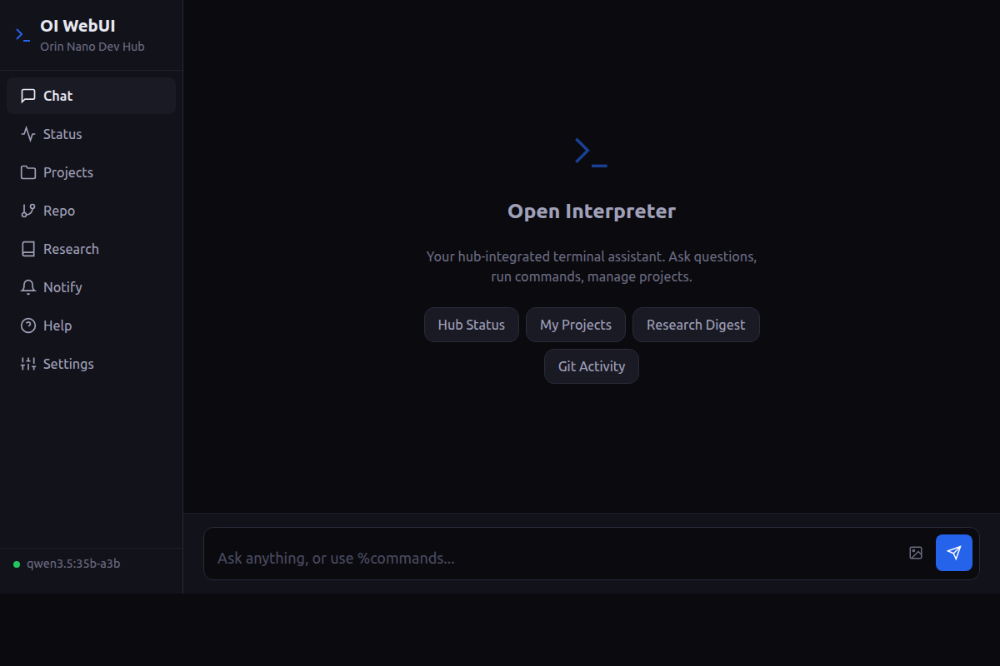
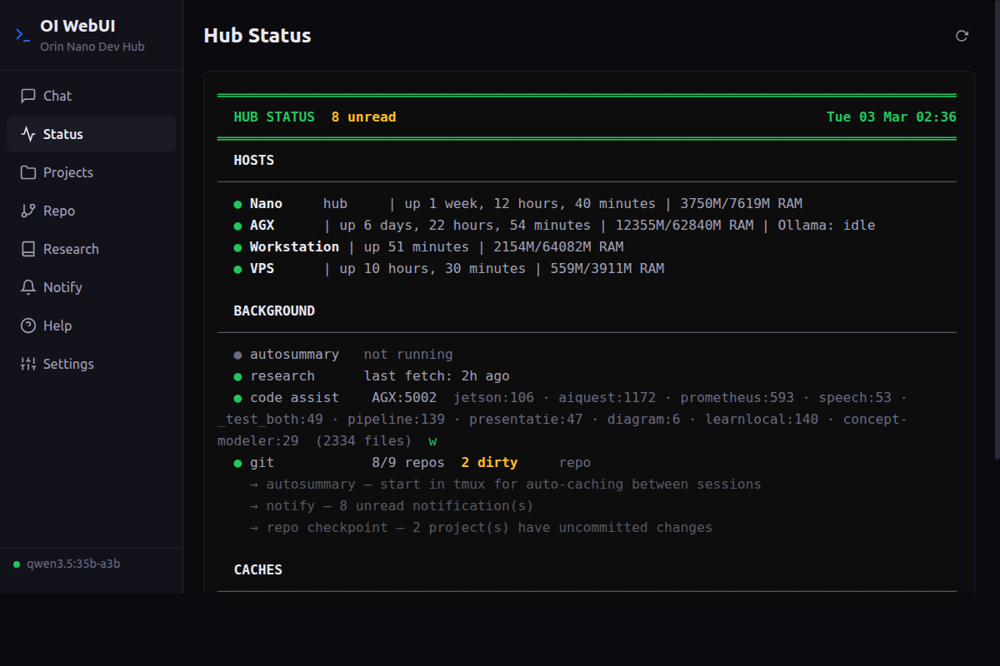
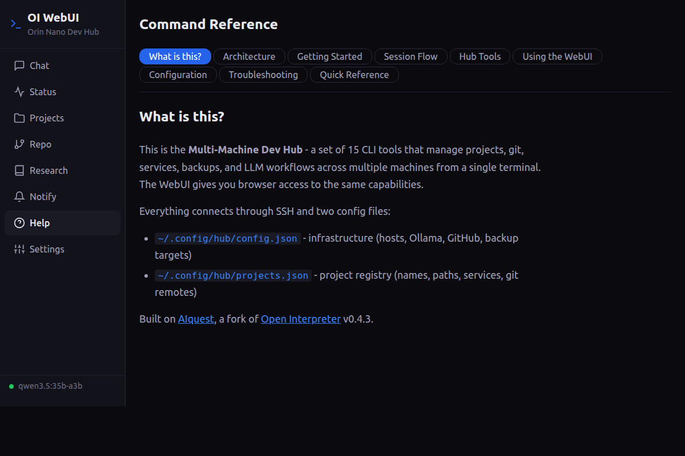

# Open Interpreter — Enhanced

**An improved Open Interpreter with selective code approval, dynamic RAG, and vision support — plus multi-machine hub tools for managing projects across distributed setups.**

> Fork of [OpenInterpreter/open-interpreter](https://github.com/OpenInterpreter/open-interpreter) v0.4.3 (AGPL-3.0) — for upstream docs see the [original README](https://github.com/OpenInterpreter/open-interpreter/blob/main/README.md).

---

### Why this exists

Open Interpreter lets an LLM run code on your machine. That's powerful, but the vanilla experience has gaps: auto_run is all-or-nothing, large outputs get mangled, there's no RAG, and there's no way to dynamically update the system message between turns.

This fork fixes those things. The core improvements — callable auto_run, Mini-RAG, vision, output handling — work on any single machine with Ollama. No multi-machine setup required.

If you *do* work across multiple machines (GPU servers, workstations, edge devices), there's a second layer: 15 CLI tools that unify git, services, LLM workflows, and project context into a single terminal. But that's optional — the OI improvements stand alone.

---

## OI Improvements

Standalone enhancements that work without hub tools — just install and use:

- **Callable auto_run** — pass a function instead of a boolean to approve commands selectively. Safe commands (ls, git status, hub tools) run automatically; destructive commands pause for confirmation. This is the mechanism behind the WebUI's Run/Skip buttons.
- **Callable custom_instructions** — dynamic system message that updates each turn. Enables RAG injection, project context switching, and any logic that needs to react to conversation state.
- **Mini-RAG** — lightweight semantic retrieval engine (all-MiniLM-L6-v2, 384-dim). Loads entries from a JSON file, embeds them, and injects the best matches into the system message each turn. No vector database — just cosine similarity.
- **Vision support** — `%image` command sends clipboard or file images to vision-capable models. Multi-image and prompted modes.
- **Streaming command output** — output appears live in the code block as it's produced, not after the command finishes. Spinners and progress updates are visible in real time
- **Escape to interrupt** — press Escape to cancel LLM generation or a running command and return to the prompt. The subprocess is killed cleanly
- **Inactivity timeout** — the 120s execution timeout resets on any output. Active commands never time out; only silent ones do
- **Sudo detection** — intercepts `sudo` commands with a warning before execution
- **Truncation fixes** — large outputs preserve their tail (not just head), ANSI escape codes stripped cleanly
- **Refresh throttle** — fast streaming output no longer floods the scrollback
- **Rich output panels** — colored diffs, aligned tables, highlighted errors
- **Context token tracking** — real token counts (via tiktoken) shown after each response in both terminal (`ctx 3.4K/44K (8%)`) and WebUI, with color-coded fill level
- **Vendored tokentrim** — fixes a [double-subtraction bug](https://github.com/KillianLucas/tokentrim/issues/11) in context window management

Full reference: **[OI Improvements documentation](docs/hub/oi-improvements.md)**

---

## Quick Start

```bash
git clone https://github.com/thehighnotes/open-interpreter.git
cd open-interpreter
pip install -e .
```

For OI improvements only, you're done — create a [profile](docs/hub/getting-started.md#quick-start-with-ollama) pointing at your Ollama instance and run `interpreter --profile my-profile.py`.

For hub tools (multi-machine management), also run:

```bash
python3 tools/hub/install.py    # interactive setup wizard
```

See the [Getting Started guide](docs/hub/getting-started.md) for configuration details, Ollama profiles, and the full `config.json` schema.

---

## Hub Tools

15 CLI tools + a web interface for managing projects across machines, all driven by `~/.config/hub/config.json`:

| Tool | Alias | Purpose |
|------|-------|---------|
| `hub` | `hub`, `status` | Dashboard, priorities, services, config |
| `git` | `repo` | Git dashboard, commit, push, checkpoint, deploy |
| `work` | — | One-command session: prepare → overview → begin |
| `overview` | — | LLM-powered project briefings |
| `research` | — | Arxiv + GitHub release monitor |
| `backup` | — | Rsync hub ecosystem to backup target |
| `code` | — | Semantic search, RAG, dependency graphs |
| `edit` | — | Structured remote file editing via SSH |
| `health-probe` | — | Host & service health checker (cron) |
| `notify` | — | Notification history viewer |
| `hubgrep` | — | Cross-ecosystem search |
| `search` | — | DuckDuckGo web search |
| `oi-web` | — | Web UI — chat, hub tabs, image upload |

Full reference: **[Hub Tools documentation](docs/hub/hub-tools.md)**

### What it looks like

**Hub dashboard** — hosts, services, caches at a glance:
```
$ hub --status

  ══════════════════════════════════════════════════════
    HUB STATUS                              Sun 02 Mar
  ══════════════════════════════════════════════════════

  HOSTS
    Hub          127.0.0.1        up 12d   3.2/7.4 GB
    GPU Server   192.168.1.100    up 12d   6.1/30.4 GB  llama3:8b
    Workstation  192.168.1.50     suspended

  BACKGROUND
    autosummary  running (pid 1234)
    research     last fetch 2h ago
    Code Assist  5 projects indexed, watcher active
```

**Session launcher** — one command to wake hosts, warm the LLM, start services, and launch your editor with full context:
```
$ work myapp
  ✓ GPU Server online
  ✓ Ollama warm (llama3:8b loaded)
  ✓ 2 services started
  ✓ Overview cache refreshed
  Launching Claude Code with context preamble...
```

### Architecture

```
┌──────────────┐         SSH          ┌──────────────────┐
│   Hub (ARM)  │◄───────────────────► │   GPU Server     │
│              │                      │                  │
│  hub tools   │    ┌────────────┐    │  Ollama (LLM)    │
│  OI / Claude │    │ Workstation│    │  Code Assistant  │
│  cron jobs   │◄──►│            │    │  project repos   │
│  backups     │SSH │ gh CLI     │    │  backup storage  │
└──────────────┘    │ project    │    └──────────────────┘
       ▲            │ repos      │             ▲
       │            └────────────┘             │
       │              SSH ▲                    │
       └──────────────────┴────────────────────┘
                    all linked via
                  ~/.config/hub/config.json
```

---

## Web Interface

Browser-based OI with hub integration — 8 tabs (Chat, Status, Projects, Repo, Research, Notify, Help, Settings), streaming markdown, code approval, image upload. Accessible from any device on the network.







```bash
oi-web                          # start on port 8585
open http://localhost:8585      # or http://<hub-ip>:8585
```

Full reference: **[WebUI documentation](docs/hub/webui.md)**

---

## OI Integration

30+ magic commands let you operate the hub from inside an OI session:

```
%status          Hub dashboard
%repo            Git dashboard
%switch myapp    Switch project context
%checkpoint      Batch commit+push all dirty projects
%research        Research digest
%image           Send clipboard/file image to vision model
%help            Show all commands
```

Full reference: **[OI Integration documentation](docs/hub/oi-integration.md)**

---

## Origin

Development happens across three machines — a workstation for coding, an AGX Orin running Ollama for inference, and an Orin Nano as the always-on hub. The tools started as shell scripts to avoid repetitive SSH sessions and kept evolving as new problems came up. Born on ARM + NVIDIA but designed to be architecture-generic — pure Python, SSH, and config files. If you can run Python 3.10+ and reach your machines over SSH, it works.

> **[Read the full story on AIquest →](https://www.aiquest.info/research/oi-hub)**
> Architecture deep-dive, development timeline, and the thinking behind each layer.

## Platform support

| Platform | Status | Notes |
|----------|--------|-------|
| Ubuntu x86_64 | Tested | Primary CI target. Bare metal and WSL2. |
| Jetson (ARM64) | Tested | Built on Orin Nano + AGX Orin. |
| Debian / RPi | Community | Pure Python + SSH — should work. Not CI-tested. |
| macOS | Untested | TUI menus fall back to numbered input. Core tools likely work. |
| Windows | Not supported | Requires WSL2. Uses `termios`, `tty`, Unix signals. |

## Documentation

| Page | Content |
|------|---------|
| [Getting Started](docs/hub/getting-started.md) | Install, config schema, Ollama profiles, host roles |
| [OI Improvements](docs/hub/oi-improvements.md) | Callable auto_run, custom_instructions, Mini-RAG |
| [Hub Tools](docs/hub/hub-tools.md) | Full reference for all 15 CLI tools |
| [Web Interface](docs/hub/webui.md) | WebUI architecture, tabs, API endpoints, responsive layout |
| [OI Integration](docs/hub/oi-integration.md) | Magic commands — project, git, infra, vision |
| [Reference](docs/hub/reference.md) | Modified files, new files, environment variables, contribution patterns |
| [Troubleshooting](docs/hub/troubleshooting.md) | Ollama, Code Assistant, WebUI — common problems and fixes |

---

## License

AGPL-3.0, same as upstream. Modified files are marked with headers. See [LICENSE](LICENSE).
