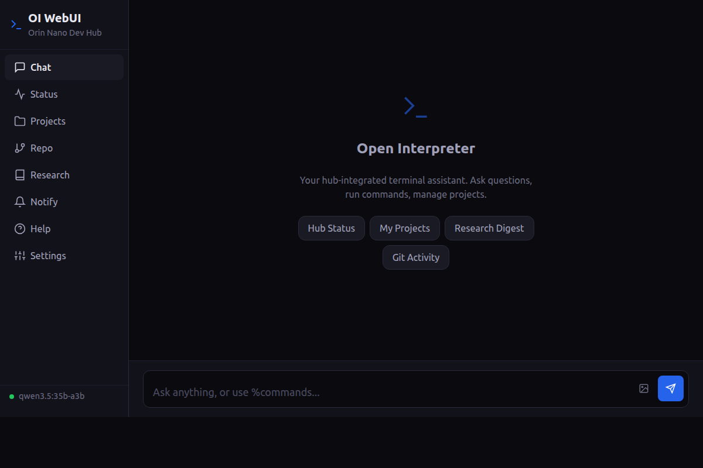
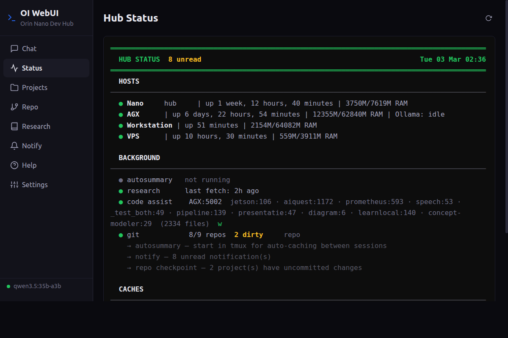
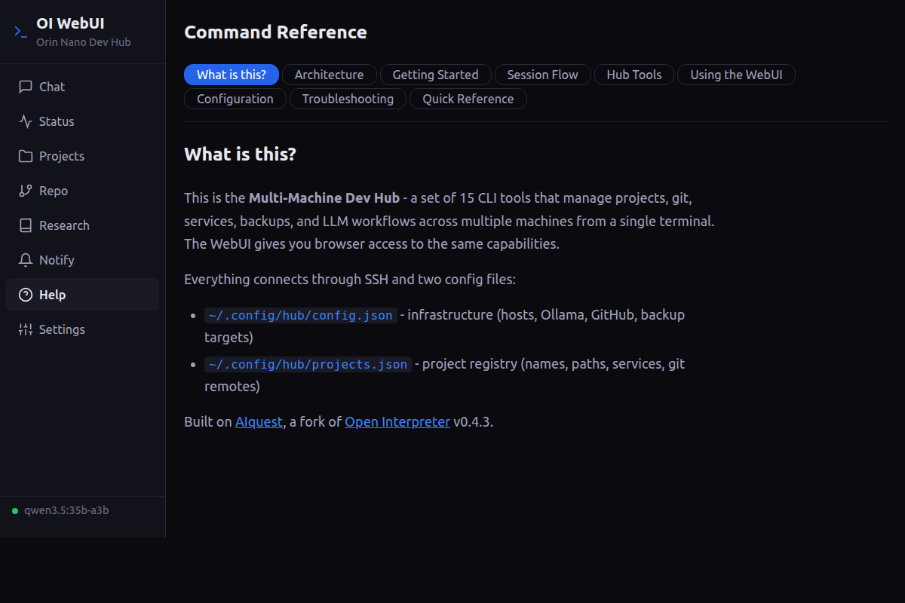

# Web Interface (oi-web)

A browser-based UI for Open Interpreter, served from the hub machine. Provides the full OI chat experience plus hub dashboard tabs — accessible from any device on the network (designed for tablet use via RustDesk or direct browser).

```
oi-web                          Start the WebUI server on port 8585
oi-web --stop                   Stop the server
oi-web --restart                Restart the server
oi-web --status                 Check if server is running
oi-web --port N                 Start on a custom port
```

Open `http://<hub-ip>:8585` in a browser.

## Architecture

```
Browser  ──HTTP──▶  Hub:8585 (Starlette)  ──Python──▶  OI Interpreter
                           │                                  │
                           ├── hub_common.py (config, projects)
                           ├── hub tools (subprocess)         ▼
                           └── static files (HTML/CSS/JS)   LLM (vLLM/Ollama)
```

A single Starlette server hosts the API and serves static files. The interpreter runs in-process as a singleton — chat responses stream via SSE (Server-Sent Events). Hub tool endpoints (`/api/status`, `/api/repo`, etc.) run the corresponding tool as a subprocess and return stripped output.

## Tabs

| Tab | Content |
|-----|---------|
| **Chat** | Full OI conversation with streaming markdown, syntax-highlighted code blocks, Run/Skip approval buttons, image upload |
| **Status** | Hub dashboard (`hub --status` output) |
| **Projects** | Project list with switch buttons — changes the interpreter's project context |
| **Repo** | Git dashboard (`repo` output) |
| **Research** | Research digest |
| **Notify** | Notification history with mark-read |
| **Mail** | LLM-driven Gmail triage — scan, review, apply workflow with fast-filter rules and insights |
| **Updates** | Clustered update scanner with LLM analysis across all hosts |
| **Help** | In-app documentation with searchable command reference |
| **Settings** | Model switcher, context window, max tokens, connection status, session reset, Gmail credentials |

## Chat Features

- **Streaming** — LLM responses stream token-by-token via SSE, rendered as markdown with syntax highlighting (vendored marked.js + highlight.js)
- **Code approval** — unsafe commands show a code block with Run/Skip buttons; safe commands (read-only, hub tools) auto-run using the same `_SAFE_PREFIXES` list as the terminal OI profile
- **Magic commands** — lines starting with `%` are detected client-side and routed to `POST /api/magic`, which runs the corresponding hub tool and returns output in a terminal-style block
- **Image upload** — button next to the input opens a file picker (with camera capture on mobile); uploads to `/tmp/oi-images/` and inserts an `%image /path` message
- **Context stats** — after each response, a `ctx 3.4K / 44K (8%)` footer shows real token usage (prompt tokens vs context window)
- **Session restore** — on page load, previous messages are fetched from the interpreter's in-memory history
- **Welcome screen** — suggestion chips for common actions (Hub Status, My Projects, Research Digest, Git Activity)

### Code approval flow

When the LLM generates a command to run, the WebUI evaluates it against `_SAFE_PREFIXES` — a list of read-only and hub tool commands (`ls`, `cat`, `git status`, `hub`, `repo`, `overview`, etc.). Safe commands auto-execute and show their output inline. Unsafe commands pause and display a code block with **Run** and **Skip** buttons:

```
┌─────────────────────────────────────┐
│ ⚠ OI wants to run:                 │
│                                     │
│   rm -rf node_modules && npm install│
│                                     │
│            [ Run ]    [ Skip ]      │
└─────────────────────────────────────┘
```

Clicking **Run** sends a POST to `/api/chat/approve` with `{"approved": true}`, and the command executes. **Skip** sends `{"approved": false}` and the LLM continues without running it. This is the same approval model as the terminal OI — the WebUI just renders it as buttons instead of a y/n prompt.

### Chat interaction example

A typical exchange looks like this:

```
You:  What's the git status of the backend project?

OI:   I'll check that for you.
      ┌──────────────────────────┐
      │ repo status backend      │  ← auto-runs (safe command)
      └──────────────────────────┘

      The backend project is on branch `main` with 2 modified files
      (src/api.py, src/auth.py) and 1 unpushed commit. No untracked files.

You:  Commit those changes

OI:   I'll stage and commit with an LLM-generated message.
      ┌──────────────────────────┐
      │ repo commit backend      │  ← auto-runs (safe command)
      └──────────────────────────┘

      Committed: "Fix session expiry and add token refresh to auth flow"
      1 commit ready to push.
```

Magic commands (lines starting with `%`) are detected client-side and routed through `/api/magic` — they bypass the LLM entirely and return tool output directly.

### Screenshots







## Mail Tab

LLM-driven Gmail triage assistant. Connects via OAuth2 and runs a two-phase classification pipeline.

### Workflow

1. **Scan** — fetches emails from Gmail API (configurable: unread/all, inbox/all labels, batch size)
2. **Fast-filter** — local pattern rules (from/subject match, optional `older_than` days) fire first, skipping the LLM for known senders
3. **LLM classification** — remaining emails are sent to the LLM with a configurable system prompt; returns keep/archive/delete per email
4. **Review** (manual mode) — user sees results with dropdowns to override each decision
5. **Apply** — approved actions execute via Gmail API (archive = remove INBOX label, delete = add TO-DELETE label + remove INBOX)

In **auto mode**, steps 4–5 happen immediately after scan.

### Filter Rules

Rules are stored locally in `~/.config/hub/mail-rules.json` and run before LLM classification. Each rule matches on `from` (substring, case-insensitive), optional `subject`, and optional `older_than` (days). Duplicate rules are prevented — adding a rule with the same from+subject as an existing enabled rule returns the existing one.

Rules can be created by clicking email addresses in the Insights panel (opens a popup with Auto-archive / Auto-delete / Unsubscribe options).

### Insights

Accumulated sender triage patterns (`~/.cache/gmail/sender-stats.json`) are periodically sent to the LLM for analysis. The response is rendered as markdown with post-processing:

- Email addresses in backticks become clickable action elements
- Markdown tables are converted to responsive cards (JS post-processing in `_optimizeMarkdown`)
- Cards show a colored left border (green = archive, red = delete) and a tinted recommendation pill

The insights prompt explicitly excludes senders already covered by existing rules to avoid redundant suggestions.

### Data Files

| Path | Purpose |
|------|---------|
| `~/.config/hub/gmail-token.json` | OAuth token |
| `~/.config/hub/mail-rules.json` | Fast-filter rule definitions |
| `~/.config/hub/mail-config.json` | Mode, scope, batch size, LLM prompts |
| `~/.cache/gmail/scan-results.json` | Latest scan results |
| `~/.cache/gmail/sender-stats.json` | Accumulated sender triage history |
| `~/.cache/gmail/suggestions.json` | Latest insights text + timestamp |
| `~/.cache/gmail/actions.jsonl` | Action audit log |

## Updates Tab

Clustered update scanner with LLM-driven analysis. Scans apt + pip across all 4 hosts, clusters packages by dependency influence (static + dynamic + hub tier), fetches GitHub release notes for intermediate versions, and runs per-cluster LLM analysis. Results display as a traffic-light UI with structured breaking changes and new features sections.

## API Endpoints

| Method | Endpoint | Purpose |
|--------|----------|---------|
| POST | `/api/chat` | SSE streaming chat |
| POST | `/api/chat/approve` | Approve/skip pending code execution |
| POST | `/api/chat/stop` | Abort current generation |
| POST | `/api/magic` | Execute magic command |
| GET | `/api/config` | Hub config (name, hosts, model) |
| GET | `/api/session` | Session info (message count, model, connection) |
| GET | `/api/session/messages` | Message history for restore |
| POST | `/api/session/reset` | Clear conversation |
| GET | `/api/status` | Hub status output |
| GET | `/api/projects` | Project list from registry |
| POST | `/api/projects/switch` | Switch project context |
| GET | `/api/repo` | Git dashboard output |
| GET | `/api/research` | Research digest output |
| GET | `/api/notifications` | Notification history |
| POST | `/api/notifications/clear` | Mark notifications read |
| GET | `/api/mail` | Mail overview (auth status, rules, actions, pending) |
| GET | `/api/mail/rules` | List filter rules |
| POST | `/api/mail/rules/add` | Create filter rule |
| POST | `/api/mail/rules/update` | Update rule by ID |
| POST | `/api/mail/rules/delete` | Delete rule by ID |
| POST | `/api/mail/scan` | Trigger scan workflow |
| POST | `/api/mail/apply` | Execute approved triage actions |
| GET/POST | `/api/mail/config` | Get/update mail settings |
| POST | `/api/mail/advice/refresh` | Re-run insights analysis |
| POST | `/api/mail/unsubscribe` | Look up List-Unsubscribe header |
| GET | `/api/settings` | Current model, context, connection |
| POST | `/api/settings/update` | Update model/context/max tokens |
| POST | `/api/image` | Upload image file |

## Responsive Layout

- **Desktop (>1024px)** — 220px sidebar with labels + content area
- **Tablet (768–1024px)** — Icon-only sidebar (56px) + content
- **Mobile (<768px)** — Sidebar hidden, horizontal tab bar at bottom

The UI is optimized for tablet viewing at 1600x900 (18px root font, 44px touch targets).

## Configuration

The server reads hub config from `~/.config/hub/config.json` (via `hub_common.load_config()`). An optional `webui/config.json` can override the port:

```json
{ "port": 8585 }
```

`webui/config.json` is gitignored. The server, frontend, and vendored dependencies are all in the repo at `tools/hub/webui/`.

## Service Registration

The WebUI is registered as a service in `projects.json` and appears in `hub --services` and `hub --status`:

```json
{ "port": 8585, "name": "OI WebUI", "start_cmd": "python3 tools/hub/webui/server.py", "dir": "." }
```
